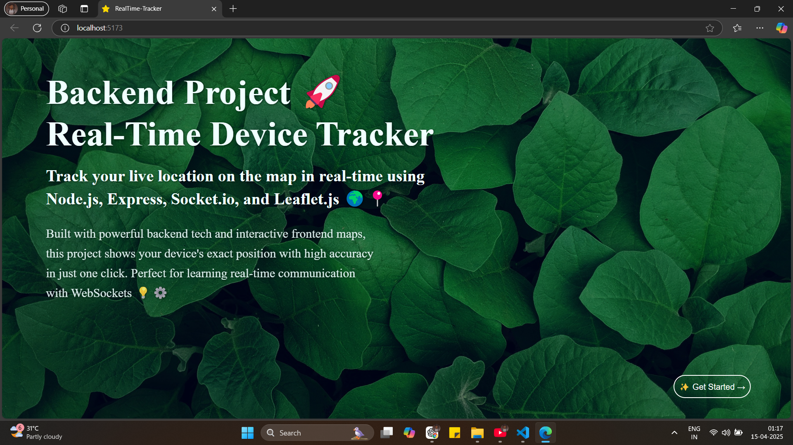

# 📍 Real-Time Device Tracker 🚀

Hey there! 👋  
This is a small project I built while learning **Backend Development** with **Node.js**, **Express**, and **Socket.io**.  
The goal was to create a simple yet working **real-time device location tracker** using **Leaflet.js** for map visuals and some frontend magic with **React**.

---
## 📷 Screenshot

---

## 🎯 What It Does

- Shows your **real-time location** on a map 🌍
- Uses browser’s **high-accuracy GPS**
- Frontend has a neat landing page with a **Get Started** button
- On click, it redirects to a live tracking map 🗺️
- Built using **Socket.io** to emit & listen to live coordinates ⚡

---

## 🛠 Tech Stack

**Frontend**: React.js, HTML, CSS  
**Backend**: Node.js, Express.js  
**Realtime**: Socket.io  
**Maps**: Leaflet.js


---

## 🚀 How to Run

1. Clone the repo  
```bash
git clone https://github.com/your-username/realtime-device-tracker.git
